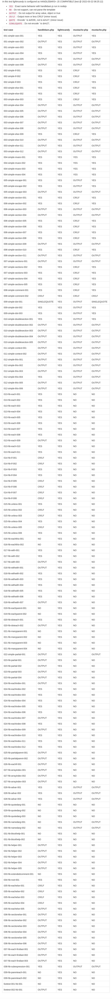

HandlebarsTest
==============

Performance tests on Mustache and Handlebars php libs. Results can be found here: http://zordius.github.io/HandlebarsTest/ .

Performance results done by others:

* https://github.com/gwicke/TemplatePerf

Current Result
--------------

Click on the chart for more details.

Requirements
------------

* php 5.3+

* [optional] nodejs04+ and handlebars for fixture generation. (See <a href="#how-to-test">How to test</a>)

Quick Conclusion
----------------
<b>Use https://github.com/zordius/lightncandy to compile handlebars in php, because:</b>

* it runs 2~6 times faster than https://github.com/bobthecow/mustache.php
* it runs 2.5~7.5 times faster than https://github.com/dingram/mustache-php
* it runs 12~47 times faster than https://github.com/XaminProject/handlebars.php

Detail reports please browse the 'report' directory.

Libraries
---------

Testing targets:

* pure php template with logic commands.
* Mustache.php https://github.com/bobthecow/mustache.php
* mustache-php https://github.com/dingram/mustache-php
* Handlebars.php https://github.com/XaminProject/handlebars.php
* lightncandy https://github.com/zordius/lightncandy

Testing data and templates:

* some fixtures are converted from https://github.com/bobthecow/mustache.php/tree/master/test/fixtures/examples

Directories
-----------

* *cloned*: all cloned library files are placed here.
* *fixture*: all data files for testing are placed here:
   * .json : testing data files in json format
   * .tmpl : testing template files
   * .txt  : correct results and library outputs
   * .php  : lightncandy generated php template
* *inc*: all required php lib files are placed here.
* *bin*: all testing scripts and commands are placed here.
* *report*: all reports generated by bin/hbreport are placed here, in different format.

Feature Comparison
------------------

How to Test
-----------
1. install nodejs04+
2. install npm
3. Now we lock the test to specific handlebars.js version.
   * test most updated npm version: `npm install handlebars`
   * download the specific version: `wget http://builds.handlebarsjs.com.s3.amazonaws.com/handlebars-c5acea7.js -O handlebars.js`
4. `bin/generate-fixture`
   * This will generate *.txt files under fixtures.
   * These files are generated with handlebars.js.
   * All tests will use these txt files as standard answers.

* single lib test
   * bin/hbtest libName testFile [testTimes]
   * libName can be one of: none , lightncandy , handlebars.php , mustache-php , mustache.php
   * testTimes default 100000. When testing on lightncandy, testTimes as even times will testing as best performance, testTimes as odd times will testing as best features.
   * Example: bin/hbtest mustache.php fixture/001-simple-vars-001.json

* feature test
   * all tests will be executed with FLAG_HANDLEBARS on (turn on all handlebars extensions on mustache)
   * Thest tests do not generate any file under report/
   * After test end, a feature chart will be outputed on console.
   * bin/hbreport 5
      * lightncandy will be executed with FLAG_JS enabled
   * bin/hbreport 7
      * lightncandy will be executed with FLAG_JS and FLAG_STANDALONE enabled.
   * bin/hbreport 1
      * lightncandy will be executed with FLAG_JS, FLAG_STANDALONE and FLAG_BESTPERFORMANCE enabled (to know more about FLAG_BESTPERFORMANCE, read lightncandy document please)
   * bin/hbreport F num_of_know_issue
      * only test on lightncandy
      * exit with (number of detected issues - number of know issues)

* performance test
   * bin/hbreport
      * This will generate report files under report/
      * default test 100000 times on every cases and libs, takes very long time.
